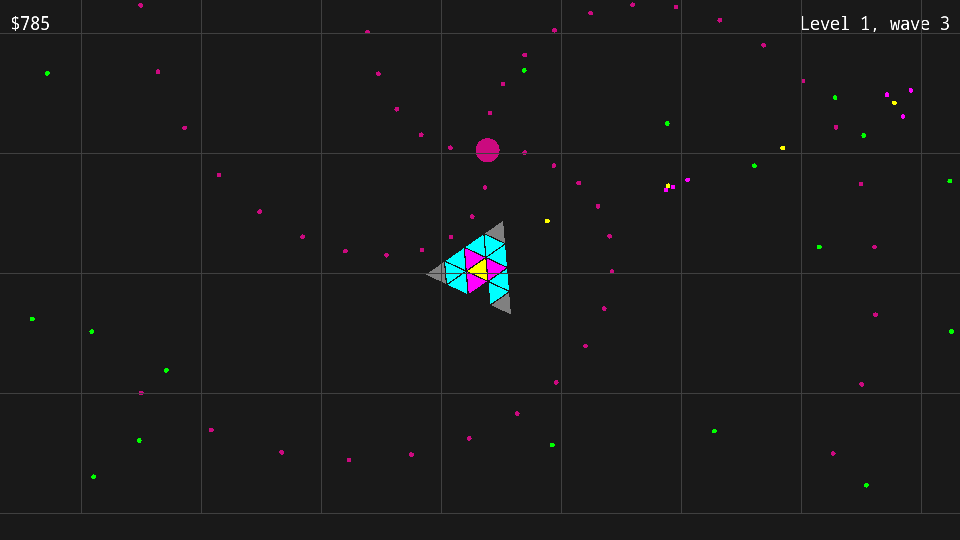

# (Poly Defence)

Authors: (Jingguo Liang, Lawrence Chen, Rakshit Tikoo)

Design: In this game you act as an antivirus software, fighting through hordes of enemies. You build your antivirus at beginning of each level in builder mode. The goal is to go through 3 levels, with a boss at the end of each level. 

Screen Shot:

How To Play:

The antivirus software is build using polygons. These represent both your health, as well as different powers. The types of polygons are as follows - 

Core - The main polygon, if destroyed, you lose. Shoots bullets too. 

Basic - Basic triangles which break on a single hit.

Defence - Hard triangles which can take multiple hits.

Shooter - Extra shooter triangles from which you can shoot bullets.

Infector - Grows 2 basic triangles on hit. 

Timestop - Activates a field of timestop, which slows down the enemies for a short while. 

You have a limited amount of money at the beggining of level 1, but you can collect green orbs to earn more money for the next level. Levels keep on getting progressively harder. The following buttons are the controls - 

Left Mouse Button - Shoots bullets in the direction of the mouse on click

W, A, S, D - Player movement

Q, E - Player rotation

F - Player timestop attack 

Space - Player bomb attack (An attack which kills all enemies hit by hit, at the expense of player triangles)

ESC - Pause Game

Arrow Keys, Enter - Movement in main menu 

Sources: 

Music from - 
https://freepd.com/

Sound effects from - 
https://sonniss.com/gameaudiogdc

Game Code Sources - 
Present as comments in the code 

This game was built with [NEST](NEST.md).

